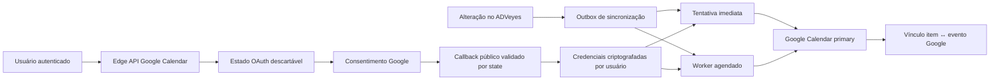

# Google Calendar multiusuário — desenho técnico

Data: 2026-07-27
Status: aprovado em conversa; aguardando revisão do documento pelo usuário

## 1. Contexto

O ADVeyes possui uma integração Google Calendar executada diretamente no
navegador. Ela usa o fluxo OAuth implícito, guarda o access token em
`localStorage` e perde a conexão quando esse token expira. Esse modelo não
permite sincronização automática confiável, renovação de acesso em segundo
plano ou isolamento operacional adequado para vários clientes.

O sistema será migrado para uma integração OAuth servidor, com uma conexão
Google independente para cada usuário do ADVeyes.

## 2. Objetivos

- Permitir que todo usuário conecte sua própria conta Google.
- Sincronizar somente no sentido ADVeyes → Google Calendar.
- Usar a agenda principal da conta conectada.
- Criar, atualizar e remover automaticamente eventos originados no ADVeyes.
- Manter a conexão mesmo quando o navegador estiver fechado.
- Renovar access tokens sem nova interação enquanto a autorização estiver
  válida.
- Impedir que um usuário acesse a conexão ou os eventos de outro.
- Repetir operações com segurança e sem criar eventos duplicados.
- Permitir sincronização manual para recuperação operacional.
- Preparar o recurso para produção, homologação e futura evolução whitelabel.

## 3. Não objetivos

- Importar eventos criados diretamente no Google para o ADVeyes.
- Propagar alterações feitas diretamente no Google de volta ao ADVeyes.
- Sincronizar calendários compartilhados ou agendas secundárias.
- Resolver conflitos de edição bidirecional.
- Usar o token do login social do Supabase para acessar o Calendar.
- Oferecer uma identidade OAuth diferente para cada whitelabel na primeira
  versão.

## 4. Decisões funcionais

- A agenda de destino será `primary`.
- Cada usuário terá no máximo uma conexão Google ativa.
- Login no ADVeyes e conexão com Calendar serão autorizações separadas.
  Usuários de e-mail/senha também poderão conectar uma conta Google.
- A sincronização será automática, com botão adicional “Sincronizar agora”.
- A primeira conexão sincronizará apenas itens futuros ou pendentes.
- Ao desconectar, o usuário escolherá entre manter ou remover do Google os
  eventos criados pelo ADVeyes.
- Os dados do ADVeyes nunca serão removidos por uma falha ou desconexão do
  Google.
- Trocar de conta exigirá confirmação explícita e exibirá o e-mail atualmente
  conectado.

## 5. Arquitetura

### 5.1 Componentes

1. **Edge API autenticada `google-calendar`**
   - inicia a conexão;
   - retorna o status da conexão;
   - solicita sincronização imediata;
   - troca de conta;
   - desconecta e, opcionalmente, remove eventos.

2. **Callback público `google-calendar-callback`**
   - não exige JWT porque é chamado pelo Google;
   - exige um `state` aleatório, de uso único e com validade curta;
   - troca o authorization code por tokens;
   - criptografa os tokens antes de persistir;
   - redireciona para a tela de Configurações com resultado não sensível.

3. **Worker `google-calendar-worker`**
   - chamado pelo cron com segredo interno;
   - processa operações vencidas em lotes pequenos;
   - renova access tokens;
   - aplica retentativas e registra erros operacionais;
   - nunca aceita acesso anônimo sem segredo.

4. **Outbox no Postgres**
   - triggers registram criação, alteração e exclusão;
   - o dado do ADVeyes é confirmado antes da chamada ao Google;
   - a fila preserva operações durante indisponibilidade externa.

5. **Cliente frontend**
   - não acessa diretamente a API do Google;
   - não recebe refresh token ou client secret;
   - consulta status e chama somente Edge Functions autenticadas.

## 6. Google Cloud

Serão usados dois clientes OAuth Web distintos dentro do projeto Google Cloud
de produção:

1. **ADVeyes Login**
   - callback do Supabase Auth;
   - somente `openid`, `userinfo.email` e `userinfo.profile`.

2. **ADVeyes Calendar**
   - callback
     `https://mrgxxwllthlwxqhehjwp.supabase.co/functions/v1/google-calendar-callback`;
   - escopo mínimo
     `https://www.googleapis.com/auth/calendar.events.owned`;
   - `access_type=offline`;
   - `include_granted_scopes=true`;
   - `prompt=consent` quando for necessário obter um novo refresh token.

Separar os clientes impede que o login básico passe a solicitar a permissão
sensível do Calendar e reduz o impacto de uma alteração futura.

Para homologação, o app Calendar ficará em modo de teste com usuários
explicitamente permitidos. Para produção com todos os clientes, o app será
publicado e submetido à verificação de marca e de escopo sensível do Google.
Enquanto o app externo estiver em teste, autorizações com Calendar expiram
após sete dias.

Será usado um projeto Google Cloud de homologação separado do projeto de
produção, conforme recomendação do Google.

## 7. Modelo de dados

### 7.1 `google_calendar_connections`

Metadados visíveis somente ao proprietário:

- `user_id uuid primary key references auth.users`;
- `google_email text`;
- `google_subject text`;
- `calendar_id text not null default 'primary'`;
- `status text`: `connected`, `reconnect_required`, `disconnecting` ou
  `error`;
- `connected_at timestamptz`;
- `last_sync_at timestamptz`;
- `last_error_code text`;
- `last_error_at timestamptz`;
- `created_at` e `updated_at`.

RLS permitirá `SELECT` apenas quando `auth.uid() = user_id`. Escritas serão
feitas exclusivamente pelas Edge Functions.

### 7.2 `google_calendar_credentials`

Tabela sem acesso de `anon` ou `authenticated`:

- `user_id uuid primary key`;
- `refresh_token_ciphertext text`;
- `refresh_token_iv text`;
- `access_token_ciphertext text`;
- `access_token_iv text`;
- `access_token_expires_at timestamptz`;
- `encryption_version integer`;
- `scope text`;
- timestamps.

Tokens serão criptografados com AES-256-GCM. A chave ficará somente no Edge
Secret `GOOGLE_TOKEN_ENCRYPTION_KEY`. O banco nunca armazenará tokens em texto
aberto, e a Data API não concederá leitura da tabela a clientes.

### 7.3 `google_calendar_oauth_states`

- hash do state, nunca o state em texto aberto;
- `user_id`;
- `return_url` previamente validada contra allowlist;
- `expires_at`;
- `consumed_at`;
- timestamps.

O state terá entropia criptográfica, validade máxima de dez minutos e poderá
ser consumido uma única vez.

### 7.4 `google_calendar_event_links`

- `user_id`;
- `entity_type`: `evento`, `audiencia`, `tarefa` ou `financeiro`;
- `entity_id uuid`;
- `google_event_id text`;
- `last_payload_hash text`;
- `last_synced_at`;
- chave única `(user_id, entity_type, entity_id)`.

### 7.5 `google_calendar_sync_queue`

- `id uuid`;
- `user_id`;
- `entity_type`;
- `entity_id`;
- `operation`: `upsert` ou `delete`;
- snapshot mínimo necessário para exclusões;
- `status`: `pending`, `processing`, `retry`, `completed` ou `failed`;
- `attempts`;
- `next_attempt_at`;
- `locked_at`;
- `last_error_code`;
- timestamps.

A fila não armazenará tokens. Operações pendentes do mesmo item serão
coalescidas, preservando a intenção mais recente.

## 8. Geração e atualização de eventos

Entidades sincronizadas:

- `eventos`;
- `audiencias`;
- `tarefas` que possuam prazo;
- `financeiro` quando houver vencimento sincronizável.

Cada evento Google terá:

- título e descrição produzidos pelo ADVeyes;
- data/hora ou evento de dia inteiro;
- fuso `America/Manaus`, respeitando dados explícitos quando disponíveis;
- `extendedProperties.private` com origem, tipo e ID do item;
- ID determinístico derivado do tipo e UUID da entidade.

O ID determinístico torna a criação idempotente. Se uma tentativa for
repetida após uma resposta perdida, o worker atualizará o evento existente em
vez de criar outro.

Sem conexão ativa, as alterações permanecerão pendentes. Após conectar, a
primeira sincronização enfileirará itens futuros ou ainda pendentes.

## 9. Retentativas e erros

Retentativas sugeridas:

1. imediata;
2. após 1 minuto;
3. após 5 minutos;
4. após 30 minutos;
5. após 2 horas.

Erros `401` ou `invalid_grant` marcarão a conexão como
`reconnect_required`. Erros de limite ou indisponibilidade usarão o cabeçalho
`Retry-After`, quando presente, e backoff. Erros definitivos de validação
marcarão somente o item como falho.

Mensagens exibidas ao usuário serão amigáveis e não incluirão tokens, payloads
sensíveis ou respostas brutas do Google.

O worker usará locking com expiração para recuperar trabalhos interrompidos.

## 10. Desconexão e troca de conta

### Manter eventos

- revogar o token no Google quando possível;
- apagar as credenciais locais;
- manter os eventos e limpar os vínculos locais;
- marcar a conexão como removida.

### Remover eventos

- enfileirar exclusões de todos os eventos vinculados;
- concluir as exclusões possíveis;
- revogar o token;
- apagar credenciais e vínculos;
- informar itens que não puderam ser removidos.

Se o token já estiver revogado, o ADVeyes não prometerá remover eventos no
Google. Ele explicará que a remoção manual pode ser necessária.

A troca de conta executará o mesmo fluxo de desconexão escolhido e iniciará
uma nova autorização. Os eventos não serão movidos silenciosamente entre
contas.

## 11. Interface

O cartão Google Calendar em Configurações exibirá:

- status;
- e-mail conectado;
- última sincronização;
- contagem de itens pendentes ou com erro;
- `Conectar`, `Sincronizar agora`, `Trocar conta` e `Desconectar`.

Itens sincronizáveis exibirão um indicador:

- sincronizado;
- aguardando;
- sincronizando;
- erro;
- reconexão necessária.

O botão manual não executará uma sincronização diferente: apenas antecipará o
processamento da mesma fila idempotente.

## 12. Segurança

- JWT obrigatório em toda função acionada pelo usuário.
- Callback público protegido por state aleatório, expirável e de uso único.
- Worker público apenas no nível de gateway, protegido por segredo interno.
- Client secret, chave de criptografia e segredo do worker em Edge Secrets.
- Refresh tokens nunca enviados ao frontend.
- RLS por `user_id` em metadados e vínculos.
- Credenciais e fila sem privilégios para `anon` e `authenticated`.
- Funções de trigger internas em schema não exposto, com `search_path` fixo e
  `EXECUTE` revogado de `PUBLIC`.
- Nenhuma autorização baseada em `user_metadata`.
- Redirect URLs restritas a origens aprovadas.
- Logs sem tokens, authorization codes ou payloads confidenciais.
- Advisories de segurança e desempenho executados após as migrations.

## 13. Configuração

Edge Secrets necessários:

- `GOOGLE_CALENDAR_CLIENT_ID`;
- `GOOGLE_CALENDAR_CLIENT_SECRET`;
- `GOOGLE_CALENDAR_REDIRECT_URI`;
- `GOOGLE_TOKEN_ENCRYPTION_KEY`;
- `GOOGLE_CALENDAR_WORKER_SECRET`;
- `APP_URL`.

O frontend deixará de depender de `VITE_GOOGLE_CLIENT_ID` para o Calendar. O
client ID não será necessário no navegador.

## 14. Homologação e critérios de aceite

1. Dois usuários conectam contas Google diferentes.
2. Cada usuário vê somente sua conexão.
3. Um usuário de e-mail/senha conecta Google Calendar.
4. Criação, edição e exclusão funcionam para cada tipo de entidade.
5. Uma operação repetida não duplica eventos.
6. Access token expirado é renovado automaticamente.
7. Falha temporária é recuperada pela fila.
8. Revogação no Google solicita reconexão.
9. Desconectar mantendo eventos preserva o Calendar.
10. Desconectar removendo eventos apaga somente itens do ADVeyes.
11. Trocar conta exige confirmação.
12. Chamadas sem JWT ou segredo recebem `401`.
13. State expirado, inválido ou reutilizado é rejeitado.
14. RLS bloqueia acesso cruzado.
15. Nenhum token aparece no navegador, logs ou respostas.
16. Build, TypeScript, testes e advisors passam.

## 15. Implantação

1. Criar projeto e cliente OAuth de homologação.
2. Aplicar migrations e configurar secrets no Supabase novo.
3. Implantar as novas Edge Functions.
4. Testar com contas autorizadas.
5. Preparar homepage, política de privacidade, termos e vídeo demonstrativo.
6. Submeter o app Google de produção à verificação.
7. Implantar frontend com o novo fluxo.
8. Monitorar erros e filas durante a ativação gradual.
9. Remover o fluxo legado de tokens em `localStorage`.

O frontend atual continuará funcionando durante a implementação. A integração
nova só será habilitada depois que migrations, functions, secrets e OAuth
estiverem disponíveis no mesmo ambiente.

## 16. Evolução whitelabel

A primeira versão usa uma identidade OAuth ADVeyes/Automatikus para todos os
clientes. Um whitelabel que precise exibir marca própria na tela de
consentimento exigirá cliente ou projeto OAuth específico e configuração por
tenant.

O modelo de conexão por usuário e o isolamento das credenciais permanecem
válidos. A evolução futura adicionará uma resolução de configuração OAuth por
tenant sem alterar o contrato de sincronização.
