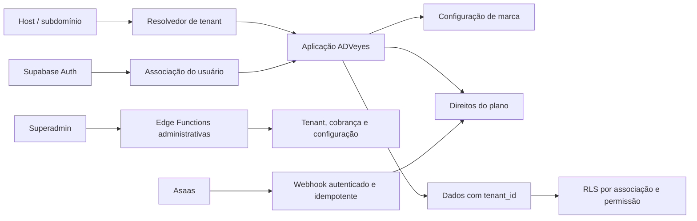
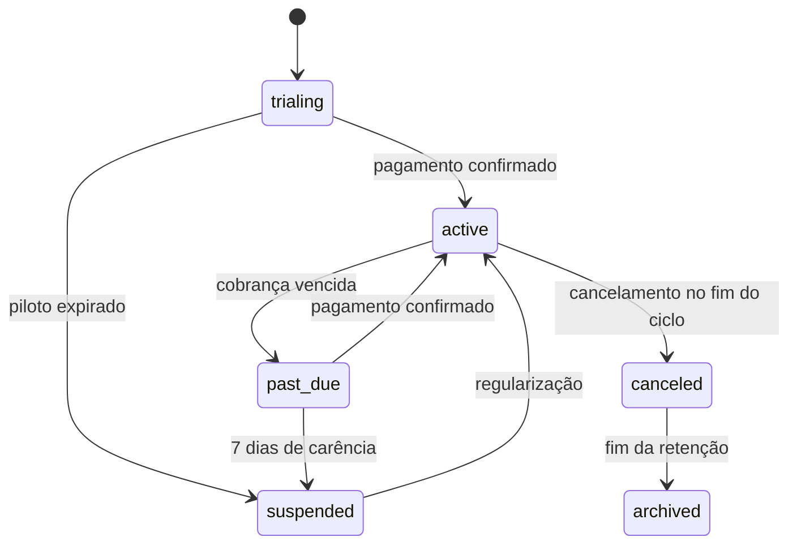

# ADVeyes multiempresa, white-label e novos planos — especificação de design

**Data:** 2026-07-28
**Status:** aprovado pelo usuário em 2026-07-28
**Substitui:** preços, limites e trial descritos em `2026-04-10-saas-core-design.md`
**Não autoriza ainda:** migrations, alteração de produção ou mudança de cobrança

## 1. Contexto

O ADVeyes já opera como aplicação jurídica com autenticação, processos,
clientes, agenda, Google Calendar por usuário e uma integração inicial com
Asaas. O modelo atual, porém, trata assinatura e dados principalmente por
`user_id`, possui nomes de marcas diferentes fixados no frontend e oferece
planos incompatíveis com uma operação white-label sustentável.

O produto será transformado em SaaS multiempresa:

- um único aplicativo;
- um único projeto Supabase;
- um tenant por escritório;
- isolamento de dados aplicado no banco;
- uma assinatura por escritório;
- marca e subdomínio configuráveis por tenant;
- usuários podendo participar de um ou mais escritórios;
- dados pertencendo ao escritório, não ao funcionário;
- Google Calendar continuando com uma autorização por pessoa.

O primeiro tenant será **Albertino Advogados Associados**. Todos os dados
existentes serão associados a ele durante a migração.

## 2. Objetivos

- Criar escritórios apenas pelo painel superadmin da Automatikus.
- Gerar um subdomínio automático para cada escritório.
- Isolar leitura e escrita por tenant usando RLS.
- Suportar funções, equipes e visibilidade por atribuição.
- Preservar os dados do escritório quando um funcionário sair.
- Centralizar toda identidade visual white-label.
- Cobrar plano, white-label e pacotes adicionais por escritório.
- Aplicar limites no backend, com avisos e sem apagar dados existentes.
- Suportar piloto assistido, anual antecipado, inadimplência e cancelamento.
- Migrar o sistema gradualmente e com possibilidade de reversão.

## 3. Não objetivos da primeira versão

- Criar um projeto Supabase separado para cada cliente.
- Permitir cadastro autônomo de novos escritórios.
- Oferecer domínio totalmente próprio; a primeira versão usa subdomínios de
  `adveyes.automatikus.com.br`.
- Oferecer marca OAuth Google própria dentro do adicional white-label padrão.
- Tornar a sincronização Google Calendar bidirecional.
- Remover imediatamente as colunas legadas por `user_id`.
- Expor dados jurídicos ao superadmin por padrão.
- Automatizar exclusão definitiva sem antes validar a política de retenção e
  as obrigações aplicáveis.

## 4. Decisões comerciais aprovadas

### 4.1 Planos

Processos cadastrados são ilimitados em todos os planos. Os limites comerciais
incidem sobre usuários, monitoramentos ativos, termos OAB/nome e IA.

| Plano | Mensal | Usuários | Monitorados | Termos | Créditos IA/mês |
|---|---:|---:|---:|---:|---:|
| Solo | R$ 79 | 1 | 100 | 1 | 100 |
| Profissional | R$ 279 | 3 | 400 | 3 | 500 |
| Escritório | R$ 619 | 10 | 1.000 | 7 | 2.000 |
| Performance | R$ 1.099 | 30 | 2.500 | 15 | 6.000 |

O plano Profissional será destacado como “mais vendido”.

Referências comerciais consultadas em 2026-07-28:

- [Projuris ADV](https://www.projuris.com.br/adv/?v=start);
- [Astrea](https://www.aurum.com.br/astrea/planos-e-precos/);
- [ADVBOX](https://advbox.com.br/planos).

Os preços buscam ficar aproximadamente 20% abaixo do concorrente comparável.
O Solo permanece em R$ 79 para evitar uma guerra de preço abaixo do custo.
Essas referências devem ser revistas pelo menos semestralmente.

### 4.2 Conteúdo funcional

| Recurso | Solo | Profissional | Escritório | Performance |
|---|---|---|---|---|
| Processos e contatos | incluído | incluído | incluído | incluído |
| Agenda e Google Calendar | incluído | incluído | incluído | incluído |
| Tarefas, prazos e publicações | incluído | incluído | incluído | incluído |
| Portal básico do cliente | incluído | incluído | incluído | incluído |
| CRM, financeiro e contratos | — | incluído | incluído | incluído |
| Automações e relatórios | — | incluído | incluído | incluído |
| Funções e permissões | — | incluído | incluído | incluído |
| Equipes e visibilidade avançada | — | — | incluído | incluído |
| Auditoria e relatórios avançados | — | — | incluído | incluído |
| White-label opcional | — | — | elegível | elegível |
| API, webhooks e BI | — | — | — | incluído |
| Onboarding assistido e SLA | — | — | — | incluído |

“Incluído” não significa consumo ilimitado. Os limites da tabela de planos
continuam valendo.

### 4.3 Pacotes adicionais

| Pacote | Preço |
|---|---:|
| 1 usuário adicional | R$ 49/mês |
| 100 monitoramentos adicionais | R$ 49/mês |
| 1 termo OAB/nome adicional | R$ 39/mês |
| 500 créditos de IA | R$ 39 |

O pacote de IA vale por 90 dias. Os demais permanecem ativos até o fim do
ciclo em que forem cancelados. A UI deve mostrar previamente a ordem de
consumo: primeiro franquia mensal; depois, créditos adicionais com vencimento
mais próximo.

Na primeira versão, uma ação de IA concluída consome um crédito padrão.
Operações premium poderão consumir mais de um crédito, desde que o custo seja
mostrado antes da execução e registrado em um catálogo versionado.

### 4.4 Piloto, anual e ativação

- Piloto assistido: 14 dias.
- Limites do piloto: 2 usuários, 30 monitoramentos, 1 termo e 50 créditos IA.
- Sem cartão obrigatório e sem white-label no piloto.
- Ao fim do piloto, operações e automações param; os dados ficam preservados
  por 30 dias para conversão.
- Plano anual: compromisso integral com dois meses grátis, desconto efetivo de
  16,7%.
- Anual pago por Pix/boleto à vista ou parcelado em até 12 vezes no cartão,
  sujeito às opções disponíveis no Asaas.
- Cliente mensal paga ativação equivalente a uma mensalidade.
- A ativação padrão é isenta no anual.

Totais anuais:

| Plano | Total anual |
|---|---:|
| Solo | R$ 790 |
| Profissional | R$ 2.790 |
| Escritório | R$ 6.190 |
| Performance | R$ 10.990 |

### 4.5 White-label

- Disponível a partir do plano Escritório.
- Implantação: R$ 2.490.
- Adicional: R$ 349/mês.
- A implantação white-label não é isenta no anual.
- Inclui subdomínio, nome, logos, favicon, cores, login, aplicação, portal,
  PDFs, contratos, relatórios, e-mails e modelos de WhatsApp.
- Serviços externos podem exibir a identidade do provedor ou da conta
  conectada.
- O consentimento Google padrão exibe ADVeyes.
- OAuth Google exclusivo por marca exige projeto, credenciais, verificação e
  orçamento separados.

## 5. Arquitetura de alto nível

O host determina qual tenant a interface pretende abrir, mas não autoriza
acesso. A autorização sempre depende da sessão e da associação ativa no
banco. Alterar o host ou um identificador no navegador não pode conceder
acesso a outro escritório.

## 6. Modelo de dados

Os nomes finais podem mudar durante o plano de implementação, mas os contratos
e responsabilidades abaixo são obrigatórios.

### 6.1 `tenants`

- `id uuid primary key`;
- `legal_name text`;
- `display_name text`;
- `slug citext unique`;
- `status`: `trialing`, `active`, `past_due`, `suspended`, `canceled`,
  `archived`;
- `trial_started_at`, `trial_ends_at`;
- `suspended_at`, `canceled_at`, `retention_until`;
- `created_by` referenciando o superadmin;
- timestamps.

O slug será normalizado, reservado contra palavras do sistema e nunca será
usado sozinho como autorização.

### 6.2 `tenant_memberships`

- chave única `(tenant_id, user_id)`;
- `role`: `owner`, `admin`, `lawyer`, `assistant`, `finance`;
- `status`: `invited`, `active`, `suspended`, `removed`;
- `data_scope`: `tenant`, `team`, `assigned`;
- `permission_overrides jsonb`;
- `invited_by`, `activated_at`, `suspended_at`, `removed_at`;
- timestamps.

Convites pendentes e membros ativos consomem vaga. Suspensos e removidos não.
O último proprietário não pode ser removido ou suspenso sem transferência de
propriedade.

`profiles` continua representando a pessoa global e não recebe `tenant_id`.
Nome, avatar e preferências pessoais ficam no perfil; papel, acesso, equipe e
preferências do escritório ficam na associação. O trigger de criação de
usuário continuará criando somente `profiles`. Ele deixará de criar trial ou
assinatura por pessoa.

### 6.3 Equipes e atribuições

- `tenant_teams`: núcleos internos do escritório;
- `tenant_team_members`: associação de membros a equipes;
- atribuições existentes ou novas tabelas de vínculo para processos, clientes
  e tarefas;
- nenhuma atribuição transfere propriedade do registro para a pessoa.

### 6.4 `tenant_brand_settings`

Contém somente configuração de marca:

- nomes público e abreviado;
- URLs ou chaves de logo claro/escuro, favicon e ícone;
- tokens de cor validados;
- contatos e dados de suporte;
- rodapés e assinaturas;
- links de política e termos;
- configurações públicas de login e portal.

Segredos de integrações nunca ficam nessa tabela. Uma função pública restrita
retorna apenas os campos seguros necessários para renderizar a tela pré-login.

### 6.5 Catálogo e assinatura

- `billing_plans`: código e versão do plano;
- `billing_plan_entitlements`: recursos e limites por versão;
- `tenant_subscriptions`: uma assinatura corrente por tenant;
- `tenant_subscription_items`: plano, white-label e pacotes;
- `tenant_usage_periods`: contadores por período;
- `ai_usage_ledger`: débitos, créditos, vencimentos e operação de origem;
- `billing_webhook_events`: deduplicação e resultado de processamento.

Valores monetários são armazenados em centavos inteiros. O preço que originou
uma assinatura é registrado como snapshot; alterar o catálogo não muda
contratos existentes silenciosamente.

### 6.6 Auditoria e administração

- `platform_admins`: usuários autorizados a operar o superadmin;
- `tenant_invitations`: convites de membros, com token hasheado e expiração;
- `tenant_audit_events`: ator, tenant, ação, alvo, horário e metadados mínimos;
- `tenant_admin_overrides`: exceções comerciais com motivo, responsável e
  expiração.

`platform_admins` não usa `user_metadata` como fonte de autorização.
Superadmins administram tenant, assinatura e configuração, mas não recebem
leitura automática dos dados jurídicos.

## 7. Aplicação de `tenant_id`

Toda tabela empresarial deverá ser classificada no inventário de migração:

1. **Pertence a tenant:** recebe `tenant_id not null`, FK e índice.
2. **Pertence ao usuário e ao tenant:** recebe ambos, como itens atribuídos.
3. **Global da plataforma:** não recebe tenant, mas fica sem escrita direta de
   clientes.
4. **Segredo interno:** acesso exclusivo de service role ou schema privado.

Exemplos de dados empresariais: clientes, processos, eventos, audiências,
tarefas, publicações, financeiro, contratos, documentos, leads, equipe,
credenciais de tribunal, monitoramentos, notificações e horas.

Arquivos do Storage usarão prefixo imutável:
`{tenant_id}/{classe}/{record_id}/{arquivo}`. As políticas validarão
associação ativa e permissão da mesma forma que as tabelas.

## 8. RLS e autorização

### 8.1 Regras fundamentais

- RLS habilitada em todas as tabelas expostas.
- Associação ativa obrigatória para o `tenant_id` da linha.
- Leitura respeita `data_scope` e atribuições.
- Escrita respeita papel, módulo e override.
- Cliente nunca escolhe um tenant livremente para elevar privilégio.
- Funções `SECURITY DEFINER` usam `search_path` fixo, owner controlado e
  privilégios mínimos.
- `anon` não executa funções administrativas.
- Toda ação de service role recebe validação equivalente na Edge Function.

### 8.2 Matriz inicial de papéis

| Capacidade | Owner | Admin | Lawyer | Assistant | Finance |
|---|---|---|---|---|---|
| Gerenciar assinatura | sim | leitura | não | não | conforme override |
| Transferir propriedade | sim | não | não | não | não |
| Gerenciar membros | sim | sim | não | não | não |
| Configurar marca | sim | sim | não | não | não |
| Dados jurídicos | sim | sim | por escopo | por escopo | não por padrão |
| Financeiro e contratos | sim | sim | conforme override | conforme override | sim |
| Exclusões críticas | sim | conforme permissão | não por padrão | não | não |
| Relatórios | sim | sim | conforme escopo | conforme escopo | financeiros |

Overrides não podem conceder transferência de propriedade nem administração
da plataforma.

### 8.3 Escopos

- `tenant`: todos os registros do módulo no escritório;
- `team`: registros atribuídos a equipes das quais o membro participa;
- `assigned`: somente registros diretamente atribuídos.

O plano de implementação deve mapear cada módulo às suas tabelas de
atribuição. Até que uma tabela tenha regra explícita, o comportamento seguro é
negar, não liberar todo o tenant.

## 9. Rotatividade e ciclo do membro

### 9.1 Convite

1. Owner ou admin informa e-mail, papel e escopo.
2. O backend confere limite de vagas.
3. Convite pendente reserva a vaga.
4. Token de uso único e expirável é enviado.
5. Após login, o usuário aceita e ativa a associação.

Uma pessoa pode participar de vários tenants com funções diferentes.

### 9.2 Suspensão ou saída

1. Associação é suspensa imediatamente.
2. Novas operações daquele tenant são bloqueadas.
3. Jobs e vínculos de agenda daquele tenant deixam de ser processados.
4. Processos, tarefas e clientes podem ser reatribuídos em lote.
5. Dados, comentários e auditoria permanecem no escritório.
6. A ação é auditada.

A conexão Google Calendar é global por usuário. Portanto, sair de um único
tenant **não revoga o token Google global** se a pessoa continuar ativa em
outro escritório. O sistema remove ou pausa apenas filas e vínculos do tenant
de origem. A credencial global só é revogada quando o próprio usuário
desconecta ou quando ele não possui outra associação ativa. Esta regra refina
a expressão genérica “revogar integrações pessoais” aprovada no desenho e
evita quebrar outros escritórios do mesmo usuário.

## 10. Google Calendar em contexto multiempresa

- `google_calendar_connections` e credenciais continuam sendo por usuário.
- OAuth state identifica também o tenant de retorno, sem transformar tenant
  em autorização.
- filas e vínculos de eventos recebem `tenant_id`.
- triggers de outbox copiam o `tenant_id` da entidade.
- worker valida associação ativa antes de enviar ao Google.
- um mesmo usuário pode sincronizar eventos de tenants diferentes na agenda
  principal; título e descrição devem permitir identificar a origem sem
  expor informação além do que o usuário já pode ver.
- suspensão de tenant impede novos envios daquele tenant.
- exclusões e troca de conta permanecem idempotentes.

O OAuth compartilhado mostra ADVeyes. OAuth exclusivo por white-label fica
fora do pacote padrão.

## 11. Resolução de subdomínio e marca

1. A requisição chega em `{slug}.adveyes.automatikus.com.br`.
2. O frontend consulta um endpoint público que retorna apenas marca segura e
   identificador opaco.
3. Antes do login, a página usa nome, logos, favicon e cores do tenant.
4. Depois do login, o backend confirma associação ativa.
5. Usuário sem associação recebe erro neutro e opção de trocar de escritório.

Será configurado DNS wildcard e certificado compatível. Slugs como `www`,
`app`, `admin`, `api`, `login`, `support` e equivalentes ficam reservados.

No host central, um usuário com mais de um tenant verá um seletor e será
redirecionado ao subdomínio escolhido.

## 12. Superadmin

O painel da Automatikus permitirá:

- criar tenant e proprietário inicial;
- escolher slug;
- iniciar, estender ou encerrar piloto;
- configurar plano, ciclo e adicionais;
- acompanhar uso e limites;
- suspender ou reativar tenant;
- configurar marca e publicar white-label;
- aplicar exceção temporária auditada;
- ver status de cobrança e falhas operacionais;
- iniciar exportação solicitada.

Criação e alteração passam por Edge Functions autenticadas. A UI não escreve
diretamente em tabelas administrativas. Acesso excepcional a dados jurídicos,
se algum dia necessário para suporte, exigirá fluxo “break glass” temporário,
motivo e auditoria; não faz parte da primeira versão.

## 13. Limites e direitos de uso

O backend calcula um snapshot de entitlements:

`plano versionado + white-label + pacotes + override temporário`.

Métricas:

- usuários: membros `active` e convites `invited`;
- monitorados: monitoramentos com estado ativo;
- termos: OABs ou nomes com busca contínua ativa;
- IA: ledger por ação concluída;
- processos cadastrados: sem limite comercial.

Alertas são emitidos em 80%, 95% e 100%. Ao chegar a 100%:

- nada existente é apagado;
- leitura continua conforme assinatura;
- novas ativações da métrica ficam bloqueadas;
- o owner pode comprar pacote ou fazer upgrade;
- uma exceção temporária exige superadmin, motivo e validade.

Limites são transacionais. Duas ativações concorrentes não podem ultrapassar a
franquia por condição de corrida.

## 14. Cobrança e ciclo de vida

### 14.1 Asaas

- uma assinatura lógica por tenant;
- plano e itens registrados internamente;
- criação e cancelamento somente pelo backend;
- webhook público protegido por token;
- deduplicação pelo identificador do evento;
- atualização transacional de evento, pagamento e entitlement;
- evento duplicado responde sucesso sem repetir efeito;
- falha temporária entra em reprocessamento;
- payload bruto sensível não aparece em logs de aplicação.

O trial passa a ser criado no fluxo administrativo de criação do tenant. O
trigger atual `handle_new_user_subscription`, que cria
`asaas_subscriptions` por usuário, será desativado somente depois que o fluxo
por tenant estiver funcionando e que usuários novos tenham um caminho válido
de convite. Durante a transição, uma proteção impedirá gerar simultaneamente
assinatura pessoal e assinatura empresarial.

Antes de ativar vendas, devem existir no novo Supabase:
`ASAAS_API_KEY` e `ASAAS_WEBHOOK_TOKEN`. O inventário atual indicou que esses
segredos ainda não estão presentes.

### 14.2 Inadimplência

- `past_due`: sete dias de carência, com acesso e alertas.
- `suspended`: modo restrito; operações, IA, monitoramentos, automações e sync
  param. Owner/admin continuam acessando cobrança, suporte e exportação.
- pagamento confirmado restaura o tenant de forma idempotente.

### 14.3 Cancelamento e retenção

- cancelamento voluntário produz efeito ao fim do período pago;
- a janela de exportação permanece disponível;
- retenção operacional proposta: 90 dias;
- depois disso, dados empresariais são eliminados ou anonimizados conforme a
  política publicada e as obrigações aplicáveis;
- registros fiscais, de segurança ou auditoria que precisem permanecer devem
  ser separados e minimizados.

A implementação da exclusão definitiva depende de revisão jurídica/LGPD da
política de retenção. Até essa aprovação, o sistema pode arquivar, mas não deve
executar purge automático irreversível.

### 14.4 Downgrade

- entra no próximo ciclo;
- dados não são apagados;
- se o uso exceder o plano de destino, o owner reduz ativos, compra pacotes ou
  cancela o downgrade;
- o backend impede novas ativações acima do limite.

## 15. Frontend

Novos contextos e componentes conceituais:

- `TenantProvider`: host, tenant selecionado, associação e troca de tenant;
- `BrandProvider`: tokens visuais e conteúdo público;
- `EntitlementsProvider`: direitos calculados no backend;
- `PermissionGate`: conveniência de UI, nunca única proteção;
- `UsageMeter`: consumo, alertas e compra de pacote;
- área superadmin separada;
- gestão de membros, equipes, convites e reatribuição;
- editor de marca com pré-visualização;
- telas de piloto, atraso, suspensão e exportação.

O `SubscriptionContext` atual, por usuário, será substituído gradualmente por
assinatura do tenant. A aplicação não deve inferir plano a partir de preço,
rota ou dados editáveis no navegador.

## 16. E-mails, PDFs, WhatsApp e portal

- templates recebem `tenant_id` e snapshot mínimo de marca;
- jobs assíncronos resolvem marca no backend;
- URLs sempre apontam ao subdomínio correto;
- PDFs registram a versão de template e marca usada;
- e-mails usam nome do escritório; domínio remetente próprio exige validação
  separada;
- WhatsApp usa textos e assinatura da marca, mas o perfil/número exibido
  depende da conta conectada;
- tokens do portal carregam tenant e recurso e são verificados no backend;
- nenhum template pode manter “Albertino”, “Lexia” ou ADVeyes quando a
  superfície estiver marcada como white-label, exceto identificação legal ou
  externa previamente definida.

## 17. Erros, observabilidade e auditoria

- códigos de erro estáveis e mensagens amigáveis;
- correlation ID por requisição administrativa e webhook;
- logs sem tokens, credenciais, documentos ou dados jurídicos desnecessários;
- fila de falhas para webhooks e jobs;
- alertas para webhook parado, fila acumulada e purge pendente;
- auditoria de convites, papéis, suspensão, reatribuição, marca, plano,
  adicionais, exceções e exportações;
- dashboards de uso agregados não devem furar RLS.

## 18. Estratégia de migração

### Fase 0 — preparação

- inventariar todas as 26 tabelas, funções, policies, triggers, buckets e Edge
  Functions;
- classificar tabelas como tenant, usuário+tenant, global ou segredo;
- confirmar backup e ensaio de restauração;
- corrigir segredos obrigatórios ausentes;
- criar feature flags de multiempresa e cobrança nova.

### Fase 1 — fundação sem bloqueio

- criar tenant Albertino;
- criar tabelas de tenant, membership, marca, catálogo, assinatura e auditoria;
- adicionar `tenant_id` inicialmente anulável nas tabelas empresariais;
- preencher todos os registros existentes com tenant Albertino;
- criar FKs e índices;
- verificar que não restou registro órfão.

### Fase 2 — RLS em paralelo

- criar helpers e policies por tenant;
- executar testes de acesso cruzado com dois tenants sintéticos;
- comparar leituras novas com comportamento legado;
- somente depois tornar `tenant_id not null`.

### Fase 3 — aplicação

- introduzir `TenantProvider`, subdomínios e seletor;
- migrar queries módulo a módulo;
- centralizar marca;
- adaptar Google Calendar, Storage e portal;
- manter compatibilidade com colunas `user_id` durante estabilização.

### Fase 4 — cobrança e limites

- carregar catálogo versionado;
- migrar assinatura atual para tenant Albertino sem cobrar novamente;
- aposentar o trigger de trial por usuário e manter apenas a criação de
  `profiles`;
- adaptar Asaas e webhook;
- ativar contadores primeiro em modo observação;
- comparar contadores com dados reais;
- só então bloquear novas ativações acima dos limites.

### Fase 5 — superadmin e primeiro white-label

- criar painel administrativo;
- configurar wildcard DNS;
- publicar o primeiro white-label;
- executar piloto interno e checklist de aceitação;
- ativar novos clientes progressivamente.

Nenhuma fase remove dados legados até passar por homologação e janela de
estabilidade. Rollback desliga as feature flags e retorna à leitura anterior;
não depende de apagar migrations ou restaurar banco.

## 19. Segurança

- RLS testada com dois tenants e múltiplos papéis.
- Service role somente em Edge Functions.
- Superadmin validado por tabela interna.
- Secrets nunca armazenados em tabelas de marca.
- Convites e tokens armazenados apenas como hash.
- Storage isolado por prefixo de tenant.
- Funções com `search_path` fixo.
- Sem autorização baseada em `user_metadata`.
- Webhook Asaas autenticado, idempotente e rate-limited.
- Google tokens criptografados e nunca enviados ao frontend.
- CSP, validação de host e allowlist de redirects.
- Exportações assíncronas com URL assinada e validade curta.
- Advisories de segurança e desempenho executados após cada grupo de
  migrations.

## 20. Testes e critérios de aceite

### 20.1 Isolamento

1. Usuário do tenant A não lê, altera, exporta ou infere registros do tenant B.
2. Trocar slug, UUID ou payload no navegador não muda autorização.
3. Storage e realtime respeitam o mesmo isolamento.
4. Superadmin não lê dados jurídicos por padrão.

### 20.2 Membros

5. Cada papel recebe apenas as capacidades previstas.
6. Escopos tenant, equipe e atribuídos funcionam em todos os módulos mapeados.
7. Convite pendente reserva vaga.
8. Suspensão interrompe acesso imediatamente.
9. Reatribuição preserva histórico.
10. Último owner não pode sair.

### 20.3 Marca

11. Cada subdomínio carrega marca antes e depois do login.
12. Login, portal, PDFs, e-mails e mensagens usam o tenant correto.
13. Cache nunca mistura marcas.
14. Marca inexistente ou host inválido falha de forma segura.

### 20.4 Planos e consumo

15. Planos, pacotes e overrides produzem entitlement correto.
16. Alertas aparecem em 80%, 95% e 100%.
17. Concorrência não ultrapassa limite.
18. Dados existentes permanecem ao atingir limite ou fazer downgrade.
19. IA debita e expira créditos corretamente.

### 20.5 Cobrança

20. Webhook duplicado não duplica efeito.
21. Pagamento ativa tenant.
22. Atraso inicia carência e suspensão após sete dias.
23. Regularização restaura acesso.
24. Cancelamento respeita fim do ciclo e retenção.
25. Plano anual e ativação geram valores aprovados.

### 20.6 Integrações e qualidade

26. Google Calendar não mistura eventos ou filas entre tenants.
27. Saída de um tenant não quebra outros tenants do mesmo usuário.
28. Exportação contém somente o tenant solicitado.
29. TypeScript, testes, build e lint das áreas alteradas passam.
30. Advisors do Supabase não introduzem novos alertas críticos.
31. Homologação usa pelo menos dois tenants, cinco papéis e dois usuários
    multi-tenant.

## 21. Dependências e riscos

- Segredos Asaas e de APIs jurídicas ausentes impedem testes completos.
- O código atual possui marcas hardcoded e precisa de inventário completo.
- O modelo atual de assinatura por usuário exige migração cuidadosa para
  tenant.
- Policies antigas por `user_id` podem abrir ou bloquear dados se forem
  alteradas parcialmente.
- White-label de e-mail e WhatsApp depende de configuração externa.
- Google OAuth próprio por cliente não está incluído.
- Limites de IA devem ser acompanhados por custo real antes da venda em escala.
- A política de retenção de 90 dias precisa de validação jurídica antes do
  purge automático.
- O worktree atual contém alterações não relacionadas; a implementação deve
  preservar e separar essas mudanças.

## 22. Questões deliberadamente adiadas

- Domínios próprios em vez de subdomínios.
- OAuth Google exclusivo como produto padronizado.
- SSO/SAML corporativo.
- Cobrança proporcional automática no meio do ciclo.
- Marketplace de módulos.
- Aplicativo móvel com marca individual.
- Acesso “break glass” para suporte.

## 23. Condição para iniciar implementação

Antes de qualquer migration:

1. o usuário revisa e aprova este documento;
2. é criado um plano de implementação por fases e tarefas pequenas;
3. o inventário de tabelas e policies é anexado ao plano;
4. backup e ensaio de restauração são confirmados;
5. os segredos obrigatórios são configurados;
6. a primeira migration é validada em ambiente de homologação.
