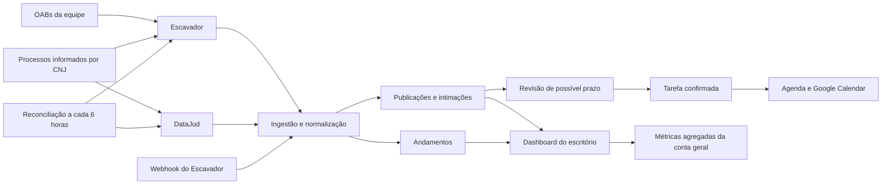

# Publicações, andamentos e dashboards por ambiente

**Data:** 30 de julho de 2026

**Status:** desenho aprovado para planejamento

**Produto:** ADVeyes

**Arquitetura escolhida:** híbrida, multitenant e orientada a eventos

## 1. Objetivo

Entregar ao ADVeyes uma operação jurídica baseada em dados reais, com:

- publicações e intimações relacionadas aos advogados do escritório;
- identificação da origem PJe, Projudi, SEEU ou outro sistema quando houver evidência do provedor;
- andamentos processuais separados das publicações;
- descoberta por OAB e monitoramento de processos informados manualmente pelo número CNJ;
- sincronização automática, reconciliação periódica e sincronização manual;
- revisão humana antes da criação definitiva de prazos;
- dashboard operacional próprio para cada escritório;
- dashboard detalhado e separado para a conta geral da plataforma.

O objetivo não é fazer acesso automatizado às áreas privadas dos tribunais nem substituir a conferência profissional das comunicações oficiais.

## 2. Problemas atuais

O sistema atual apresenta quatro problemas que precisam ser corrigidos em conjunto:

1. A tabela e a tela de publicações misturam comunicações jurídicas com movimentos obtidos no DataJud.
2. A interface anuncia PJe, Projudi e SEEU sem comprovar em cada registro qual provedor e qual sistema originaram o dado.
3. Registros demonstrativos podem ser confundidos com dados reais.
4. `HomeEntry` direciona todo administrador da plataforma para `/admin`, fazendo a visão geral administrativa substituir o dashboard operacional do escritório.

## 3. Decisões aprovadas

- Usar **Escavador e fontes oficiais de forma híbrida**.
- Usar o **Escavador** para descoberta por OAB, publicações/intimações, atualizações e callbacks disponíveis no plano contratado.
- Usar o **DataJud** para consulta pública de processos e andamentos por número CNJ.
- Manter **Publicações e intimações** separadas de **Andamentos** na interface e no banco.
- Monitorar tanto as OABs vinculadas à equipe quanto processos adicionados manualmente.
- Receber atualizações por webhook e executar reconciliação a cada seis horas.
- Manter o botão **Sincronizar agora**.
- Nunca transformar automaticamente uma data detectada em prazo jurídico definitivo.
- Criar uma sugestão de tarefa que exige confirmação humana.
- Separar o dashboard da conta geral do dashboard de cada escritório.
- Usar um seletor de ambiente para usuários que possam acessar mais de um contexto.

## 4. Terminologia

### Publicação ou intimação

Comunicação jurídica dirigida a uma parte, advogado ou representante, com conteúdo próprio de diário, expediente ou comunicação processual. Um registro só será classificado assim quando o provedor informar natureza ou evidência compatível.

### Andamento

Movimento no histórico do processo, como juntada, despacho, conclusão, distribuição ou mudança de situação. Um movimento do DataJud nunca será gravado como publicação.

### Sistema de origem

Sistema indicado pela fonte para aquele evento, como PJe, Projudi ou SEEU. A classificação não será inferida apenas pelo tribunal. Quando não houver evidência suficiente, o sistema será exibido como **Não identificado**.

### Provedor

Serviço que entregou o dado ao ADVeyes, inicialmente `escavador` ou `datajud`.

### Ambiente

Contexto ativo da interface:

- `platform`: conta geral ADVeyes;
- `tenant`: um escritório específico.

## 5. Arquitetura

### 5.1 Componentes

#### Cadastro de fontes monitoradas

Mantém as OABs ativas da equipe e os números CNJ adicionados manualmente. Todo item pertence a um `tenant_id`. Desativar um membro ou processo interrompe novas consultas, mas preserva o histórico.

#### Adaptador Escavador

Centraliza autenticação, paginação, limite de consumo, interpretação das respostas e identificação do sistema de origem. O token fica somente nos secrets das Edge Functions.

#### Adaptador DataJud

Consulta metadados e movimentos por número CNJ, usando a autenticação já configurada. Seu resultado alimenta exclusivamente processos e andamentos.

#### Normalizador

Transforma respostas dos provedores em contratos internos estáveis. A interface não depende diretamente do formato externo de nenhuma API.

#### Ingestor idempotente

Deduplica eventos por identificador externo e, quando ele não existir, por uma impressão digital determinística do conteúdo normalizado.

#### Revisor de prazo

Marca uma publicação com possível prazo e gera uma sugestão. A confirmação exige data, responsável e vínculo com processo antes de criar tarefa ou evento.

#### Monitor de integrações

Registra última execução, próxima execução, quantidade encontrada, falhas, tentativas, indisponibilidade e alertas de consumo.

## 6. Modelo de dados conceitual

O plano de implementação definirá os nomes finais das migrations, mas deverá preservar estas responsabilidades:

### `publicacoes`

Evoluir a tabela existente para conter, no mínimo:

- `tenant_id` obrigatório;
- processo relacionado quando identificado;
- advogado/OAB relacionado;
- provedor;
- identificador externo;
- hash de deduplicação;
- sistema de origem;
- tribunal e órgão;
- data de disponibilização e data de publicação;
- conteúdo;
- status de revisão;
- indicação de possível prazo;
- dados brutos mínimos necessários para auditoria;
- datas de criação e atualização.

Não usar `user_id` como fronteira principal de visibilidade. A publicação pertence ao escritório e sua autorização deriva do `tenant_id`.

### `processo_andamentos`

Armazena movimentos reais separados, com:

- `tenant_id`;
- `processo_id`;
- provedor;
- identificador externo ou hash;
- data e descrição;
- tipo normalizado;
- sistema de origem quando informado;
- versão resumida dos dados de origem.

### Fontes monitoradas

Representam:

- OABs vinculadas a profissionais ativos do escritório;
- processos monitorados por número CNJ;
- estado de ativação;
- último cursor ou instante sincronizado;
- última execução bem-sucedida;
- próximo horário de reconciliação.

### Eventos e execuções de integração

Registram webhooks recebidos, jobs, tentativas, resultado parcial, erro sanitizado e métricas de consumo. O corpo bruto só será preservado quando necessário e sem segredos.

### Sugestões de prazo

Mantêm a publicação de origem, data sugerida, justificativa, estado de revisão e usuário que confirmou ou rejeitou. Uma sugestão não é uma tarefa e não deve aparecer como prazo confirmado.

## 7. Regras de deduplicação e origem

1. Preferir o identificador externo estável do provedor.
2. Na ausência dele, calcular hash com provedor, processo, data, órgão e conteúdo normalizado.
3. Webhooks repetidos devem atualizar o mesmo registro sem duplicá-lo.
4. O mesmo andamento obtido por DataJud e Escavador pode manter evidência de ambos os provedores.
5. Divergências não serão sobrescritas silenciosamente; ficarão sinalizadas para auditoria.
6. PJe, Projudi e SEEU só serão atribuídos quando a resposta do provedor trouxer evidência compatível.
7. Registros sem evidência serão classificados como **Não identificado**.

## 8. Fluxos funcionais

### 8.1 Descoberta por OAB

1. O profissional ativo possui OAB validada no escritório.
2. O ADVeyes registra ou atualiza a fonte monitorada.
3. O Escavador retorna processos e comunicações relacionados.
4. O normalizador classifica cada item como publicação, andamento ou dado de processo.
5. O ingestor aplica `tenant_id`, deduplica e persiste.
6. O dashboard e as telas detalhadas são atualizados.

### 8.2 Processo informado manualmente

1. O usuário informa um número CNJ.
2. O sistema valida o formato.
3. DataJud consulta o processo e seus movimentos públicos.
4. Quando disponível, o Escavador complementa o histórico e as comunicações.
5. O processo passa a integrar a reconciliação periódica do escritório.

### 8.3 Webhook

1. A Edge Function valida a autenticidade da requisição.
2. Registra o evento de forma idempotente.
3. Responde rapidamente ao provedor.
4. O processamento normaliza e persiste o conteúdo.
5. Falhas entram em retentativa sem solicitar novo envio ao usuário.

### 8.4 Reconciliação

1. Um job executado a cada seis horas seleciona fontes vencidas.
2. O trabalho é dividido por escritório e por fonte para evitar uma falha global.
3. Cada provedor é consultado de acordo com seus limites.
4. Resultados parciais são preservados.
5. A próxima execução e o estado da integração são atualizados.

### 8.5 Revisão de prazo

1. Uma publicação recebe indicação de possível prazo.
2. O usuário abre **Revisar prazo**.
3. Confirma ou corrige data, responsável e processo.
4. Somente após confirmação é criada a tarefa.
5. A integração existente com o Google Calendar pode sincronizar o evento confirmado.
6. Rejeições permanecem auditáveis e não criam tarefas.

## 9. Interface de publicações e andamentos

### Aba `Publicações e intimações`

- Exibe somente comunicações jurídicas reais.
- Permite filtros por advogado/OAB, sistema, tribunal, urgência, status e período.
- Usa os estados `Nova`, `Em revisão`, `Confirmada`, `Lida` e `Arquivada`.
- Destaca possíveis prazos sem apresentá-los como prazo confirmado.
- Oferece a ação **Revisar prazo**.

### Aba `Andamentos`

- Exibe o histórico cronológico dos movimentos processuais.
- Mostra se o dado veio do DataJud, Escavador ou de ambos.
- Sinaliza divergências.
- Permite abrir o processo e sua linha do tempo.

### Painel de sincronização

Mostra:

- última e próxima sincronização;
- OABs e processos monitorados;
- publicações e andamentos encontrados;
- falhas por provedor;
- disponibilidade e alerta de consumo do Escavador;
- botão **Sincronizar agora**.

## 10. Dashboards e navegação por ambiente

### 10.1 Abordagem

Não será usado um dashboard misto nem um redirecionamento fixo baseado apenas no papel de administrador. A interface terá um **seletor de ambiente**.

### 10.2 Conta geral ADVeyes

Disponível somente a administradores da plataforma. Deve exibir indicadores clicáveis:

- escritórios totais, ativos, suspensos e em teste;
- usuários ativos;
- planos, assinaturas, faturamento e inadimplência;
- processos monitorados;
- convites pendentes;
- consumo e disponibilidade do Escavador;
- estado do DataJud;
- falhas de integração.

Cada indicador abre sua listagem ou visão detalhada correspondente. A tabela de escritórios continua permitindo abrir apenas escritórios para os quais o administrador tenha vínculo ou autorização explícita.

### 10.3 Dashboard do escritório

Cada escritório preserva sua identidade visual e recebe indicadores clicáveis, sempre filtrados pelo `tenant_id` ativo:

- processos e casos;
- novas publicações e intimações;
- possíveis prazos aguardando revisão;
- prazos urgentes confirmados;
- tarefas pendentes e atrasadas;
- próximas audiências;
- agenda;
- clientes e leads;
- horas trabalhadas;
- financeiro;
- equipe;
- situação das integrações.

O dashboard operacional existente em `Index.tsx` será preservado e evoluído, não substituído pelo painel administrativo.

### 10.4 Comportamento após login

- Usuário com um único escritório entra diretamente nele.
- Usuário com vários escritórios entra no último escritório utilizado; se não houver preferência válida, usa o primeiro vínculo ativo e pode trocar pelo seletor.
- Administrador da plataforma que também participa de escritórios vê `Conta geral — ADVeyes` e os escritórios autorizados no seletor.
- A seleção anterior será lembrada localmente, mas sempre será revalidada contra as permissões atuais antes de ativar o ambiente.
- A opção **Visão geral** abre o dashboard do ambiente ativo.
- A rota `/admin` continua protegida e representa somente a conta geral.
- A rota `/` não redireciona automaticamente um administrador para `/admin`.

## 11. Segurança e isolamento

- Todas as novas tabelas públicas terão RLS habilitada.
- Políticas de escritório combinarão `TO authenticated` com verificação efetiva de vínculo ao `tenant_id`.
- `authenticated` isoladamente não será considerado autorização.
- Papéis não serão autorizados por `user_metadata`.
- Views expostas usarão `security_invoker` quando suportado ou terão acesso público revogado.
- Funções privilegiadas ficarão em schema não exposto, terão `search_path` fixo, validação explícita do usuário e `EXECUTE` revogado de `PUBLIC`.
- `service_role`, token do Escavador e chaves de provedor nunca serão enviados ao navegador.
- Webhooks terão autenticação, idempotência e limite de tamanho.
- Acesso administrativo a conteúdo jurídico será excepcional, autorizado e registrado em auditoria.
- O seletor de ambiente não concede permissão; ele apenas ativa um vínculo já autorizado.

## 12. Falhas e recuperação

- Falhas transitórias terão até cinco retentativas, inicialmente após 1 minuto, 5 minutos, 30 minutos, 2 horas e 6 horas; limites específicos documentados pelo provedor prevalecem.
- Falhas permanentes, como token inválido, serão interrompidas e exibidas no painel.
- A indisponibilidade do Escavador não impedirá consultas de andamentos pelo DataJud.
- A indisponibilidade do DataJud não eliminará eventos já recebidos do Escavador.
- O sistema apresentará estado parcial: **Andamentos atualizados; publicações temporariamente indisponíveis**, quando aplicável.
- Saldo baixo ou limite de consumo do Escavador produzirá alerta antes da interrupção.
- Jobs definitivamente falhos permanecerão disponíveis para reprocessamento administrativo.
- Erros visíveis ao usuário serão compreensíveis; detalhes técnicos e segredos ficarão restritos aos logs.

## 13. Migração dos dados existentes

1. Fazer backup lógico das tabelas afetadas.
2. Adicionar os novos campos e estruturas sem excluir dados inicialmente.
3. Reclassificar como andamento todo registro comprovadamente gerado a partir de movimento do DataJud.
4. Identificar dados de demonstração e removê-los da produção ou marcá-los explicitamente como `demo`.
5. Manter publicações com origem verificável.
6. Marcar registros sem proveniência suficiente como **Revisão necessária**.
7. Preencher `tenant_id` usando os vínculos existentes e impedir novos registros sem escritório.
8. Comparar contagens antes e depois da migração.
9. Liberar a nova interface somente após validar RLS, deduplicação e amostras reais.

## 14. Testes e critérios de aceite

### Integrações

- Um webhook repetido não cria duplicatas.
- A reconciliação encontra evento perdido pelo webhook.
- Falha em um escritório não interrompe os demais.
- DataJud nunca cria linha em `publicacoes`.
- O sistema de origem só aparece quando comprovado.
- Falha de um provedor mantém os dados do outro disponíveis.

### Multitenancy

- Um membro do escritório A não lê, altera nem deduz dados do escritório B.
- Alterar valores no navegador não contorna a RLS.
- Um administrador de escritório não acessa a conta geral.
- Um administrador da plataforma só abre um escritório quando houver vínculo ou autorização auditável.

### Dashboards

- Usuário comum abre o dashboard do escritório.
- Administrador da plataforma não é forçado a `/admin` ao acessar `/`.
- O seletor alterna entre conta geral e escritórios autorizados.
- Todos os indicadores clicáveis levam a telas filtradas pelo ambiente ativo.
- Trocar o ambiente invalida consultas e recarrega os indicadores com o novo `tenant_id`.
- O dashboard do Albertino e o dashboard da conta geral exibem dados distintos e coerentes.

### Prazos

- Uma sugestão não aparece como tarefa confirmada.
- Criar tarefa exige confirmação humana.
- A confirmação registra usuário, data e publicação de origem.
- Rejeitar a sugestão não cria tarefa nem evento no calendário.

### Migração

- Nenhum registro real é descartado sem classificação documentada.
- Dados demonstrativos não aparecem como dados reais.
- Contagens e amostras são conferidas antes da ativação.
- Advisors do banco não apresentam nova vulnerabilidade causada pelas migrations.

## 15. Fora do escopo desta entrega

- Automação por certificado digital nas áreas privadas de PJe, Projudi ou SEEU.
- Robôs de navegador para captura de intimações.
- Cálculo jurídico autônomo e definitivo de prazos.
- Substituição da consulta aos portais oficiais.
- Suporte a provedores jurídicos adicionais além da base preparada pela arquitetura de adaptadores.

## 16. Sequência recomendada de implementação

O plano detalhado deverá decompor a entrega nesta ordem:

1. corrigir contexto de navegação e restaurar os dois dashboards;
2. preparar modelo de dados, RLS e migração segura;
3. separar publicações de andamentos no backend;
4. implementar adaptadores e normalização;
5. implementar webhook, jobs e reconciliação;
6. implementar telas, filtros e painel de sincronização;
7. implementar revisão humana de prazo;
8. migrar e validar dados existentes;
9. executar testes de isolamento, integração e aceite;
10. ativar gradualmente em produção.

## 17. Resultado esperado

Cada escritório terá uma visão operacional própria, detalhada e clicável. A conta geral terá seu painel administrativo independente. Publicações, intimações e andamentos serão reais, auditáveis, isolados por escritório e apresentados sem prometer uma cobertura que a fonte não comprovou. O ADVeyes continuará útil durante falhas parciais e nunca criará um prazo jurídico definitivo sem confirmação humana.
