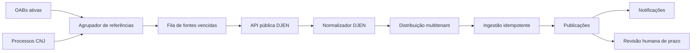

# Ingestão automática de publicações oficiais do DJEN

**Data:** 1º de agosto de 2026  
**Status:** desenho aprovado para planejamento  
**Produto:** ADVeyes  
**Escopo:** publicações oficiais por OAB/UF e número CNJ de processo

## 1. Objetivo

Integrar o ADVeyes à API pública oficial do Diário de Justiça Eletrônico
Nacional (DJEN), consultando automaticamente novas comunicações a cada dez
minutos e distribuindo-as aos escritórios que monitoram a OAB ou o processo
correspondente.

A entrega complementa a arquitetura jurídica híbrida já aprovada. O DJEN será
a fonte oficial de publicações; o DataJud continuará fornecendo processos e
andamentos; o Escavador permanecerá como fonte complementar quando sua
credencial estiver disponível.

## 2. Escopo aprovado

- Monitorar OAB e UF dos profissionais ativos de cada escritório.
- Monitorar números CNJ de processos cadastrados no escritório.
- Não realizar pesquisa aberta pelo nome das partes nesta primeira versão.
- Executar consultas automáticas a cada dez minutos.
- Manter sincronização manual por escritório.
- Gerar notificações de novas publicações.
- Nunca criar prazo, tarefa ou evento de calendário sem confirmação humana.

## 3. Alternativas consideradas

### Consulta separada por escritório

É simples, mas repete consultas quando a mesma OAB ou processo está vinculado a
mais de um escritório e consome desnecessariamente o limite da API.

### Consulta única com distribuição multitenant — escolhida

Agrupa OABs e processos iguais, consulta cada referência uma vez e distribui os
resultados somente aos escritórios vinculados. É a opção com melhor equilíbrio
entre atualização, custo e escalabilidade.

### Processamento diário dos cadernos completos

Reduz pesquisas específicas, mas exige processamento de grandes arquivos e só
fica disponível após a consolidação diária. Poderá ser usado no futuro como
reconciliação adicional, mas não integra esta entrega.

## 4. Fonte oficial

O adaptador usará a API pública documentada pelo CNJ:

```text
GET https://comunicaapi.pje.jus.br/api/v1/comunicacao
```

Filtros utilizados:

- `numeroOab` e `ufOab` para fontes de advogado;
- `numeroProcesso` para fontes de processo;
- `dataDisponibilizacaoInicio` e `dataDisponibilizacaoFim` como janela;
- `pagina` e `itensPorPagina=100` para paginação;
- `meio=D` para publicações do Diário Eletrônico.

O cliente observará `x-ratelimit-limit` e `x-ratelimit-remaining`. Uma resposta
`429` interrompe novas chamadas por pelo menos um minuto, sem contornar o limite
por múltiplos IPs.

## 5. Arquitetura



### 5.1 Adaptador DJEN

Um módulo sem conhecimento de banco monta requisições, percorre páginas,
normaliza erros HTTP e devolve o resultado junto com o estado de rate limit. O
adaptador terá timeout, limite de páginas e payload máximo defensivo.

### 5.2 Fontes monitoradas

As fontes existentes serão ampliadas para aceitar o provedor `djen`:

- fonte `oab`: referência canônica `NUMERO/UF`;
- fonte `process`: número CNJ formatado;
- próxima execução a cada dez minutos após sucesso;
- cursor temporal baseado na última disponibilização confirmada;
- margem de sobreposição na janela para evitar perda na fronteira temporal.

A sobreposição pode retornar dados já vistos; a ingestão idempotente deve
eliminá-los.

### 5.3 Agrupamento global

O job busca fontes vencidas e agrupa por tipo e referência. A consulta externa
ocorre uma única vez por OAB/UF ou número CNJ. O resultado é então aplicado
separadamente a cada `tenant_id` associado à referência.

O agrupamento reduz chamadas externas, mas não mistura persistência: cada linha
continua pertencendo a um único escritório e as regras RLS permanecem baseadas
em `tenant_id`.

### 5.4 Normalização

O contrato interno de publicação será ampliado para aceitar o provedor `djen`.
O normalizador deve mapear:

- `id` e `hash` como identidades externas;
- `data_disponibilizacao` como instante oficial disponível;
- tribunal, órgão, tipo de comunicação e documento;
- texto e link do inteiro teor;
- número CNJ formatado;
- destinatários e respectivos polos;
- advogados, números e UFs de OAB;
- payload mínimo necessário para auditoria.

O sistema de origem só será classificado como PJe, Projudi, SEEU ou outro se o
payload ou link fornecer evidência. DJEN é o provedor e meio de publicação, não
prova isolada do sistema processual de origem.

### 5.5 Ingestão e deduplicação

Para cada escritório associado, a publicação será persistida com:

1. `external_id` baseado no identificador oficial;
2. `content_hash` baseado no hash oficial ou impressão determinística;
3. vínculo automático ao processo quando o número CNJ existir no escritório;
4. provedor `djen`;
5. estado inicial `new` e possível prazo apenas como sugestão.

Os índices únicos existentes por escritório, provedor e identidade continuarão
impedindo duplicação em reconciliações sobrepostas.

### 5.6 Notificações

Somente publicações criadas pela primeira vez geram notificação. A notificação
pertence ao escritório, identifica tribunal, processo e advogado quando
disponíveis e abre a publicação correspondente. Reprocessamentos idempotentes
não geram novo alerta.

## 6. Agendamento e operação

- Um job `pg_cron` chama a Edge Function coletora a cada dez minutos.
- A chamada usa segredo interno, nunca credencial exposta ao navegador.
- Cada execução processa um lote limitado de referências vencidas.
- Referências excedentes permanecem vencidas para o próximo lote.
- Sincronização manual prioriza fontes do escritório solicitado, mas respeita o
  mesmo rate limit.
- Sucesso agenda a fonte para dez minutos depois.
- Falhas transitórias usam a política já existente de retentativas.
- `429` aplica pausa global mínima de um minuto.
- Erros permanentes são sanitizados e exibidos no painel de integrações.

## 7. Segurança e isolamento

- A consulta externa é pública, mas somente Edge Functions realizam a ingestão.
- `service_role` permanece apenas no backend.
- O job valida seu segredo antes de consultar ou gravar dados.
- Cada publicação é gravada individualmente por `tenant_id`.
- As políticas RLS existentes continuam sendo a barreira de leitura e gestão.
- Usuários não podem escolher arbitrariamente outro escritório durante a
  sincronização manual.
- Payloads externos não são usados para autorizar acesso.
- Texto e links externos são tratados como dados não confiáveis na interface.

## 8. Falhas e observabilidade

Cada execução registra:

- referência e tipo consultados;
- quantidade recebida, criada e ignorada;
- páginas percorridas;
- limite e saldo de requisições quando informados;
- duração;
- código de erro sanitizado;
- última execução bem-sucedida e próxima execução.

Uma falha em uma referência ou escritório não cancela os resultados já
persistidos nem interrompe as demais referências do lote.

## 9. Testes

### Unidade

- normalização de publicação DJEN;
- formatação de números CNJ e OAB;
- detecção de possível prazo;
- paginação e parada por limite;
- tratamento de `429`, timeout e payload inválido;
- identidade externa e hash de fallback.

### Integração

- OAB repetida é consultada uma vez e distribuída a dois escritórios;
- publicação repetida não duplica linha nem notificação;
- processo conhecido é vinculado automaticamente;
- processo desconhecido preserva a publicação sem vínculo;
- escritório não associado não recebe a publicação;
- falha parcial preserva resultados anteriores;
- sincronização manual valida vínculo e permissão.

### Banco e segurança

- RLS impede leitura cruzada entre escritórios;
- roles públicas não executam funções internas;
- job sem segredo válido é rejeitado;
- advisors não apresentam nova vulnerabilidade após as migrations.

## 10. Implantação

1. Adicionar suporte ao provedor `djen` por migration.
2. Criar fontes DJEN a partir das OABs e processos já ativos.
3. Publicar adaptador, normalizador e coletor sem ativar o cron.
4. Executar consulta controlada em um escritório e validar amostras.
5. Ativar o cron de dez minutos.
6. Monitorar taxa, erros e duplicidades.
7. Liberar o estado da integração e a sincronização manual na interface.

## 11. Critérios de aceite

- Uma publicação oficial nova aparece no escritório correto em até vinte
  minutos, considerando duas janelas de execução.
- OAB e processo iguais não causam chamadas externas redundantes no mesmo lote.
- Nenhuma publicação é duplicada por sobreposição, paginação ou reexecução.
- Uma publicação pode existir sem processo local e ser vinculada posteriormente.
- O sistema respeita rate limit e não tenta contorná-lo.
- DataJud não cria publicações e DJEN não cria andamentos.
- Nenhum prazo ou tarefa é criado sem confirmação humana.
- Sincronização e leitura permanecem isoladas por escritório.

## 12. Fora do escopo

- Pesquisa aberta por nome de parte.
- Acesso à caixa privada do advogado no PJe ou Domicílio Judicial Eletrônico.
- Webhook interno ou acesso ao RabbitMQ do PJe.
- Download e processamento integral dos cadernos diários.
- Robôs de navegador e uso de certificado digital.
- Cálculo definitivo e autônomo de prazos.

